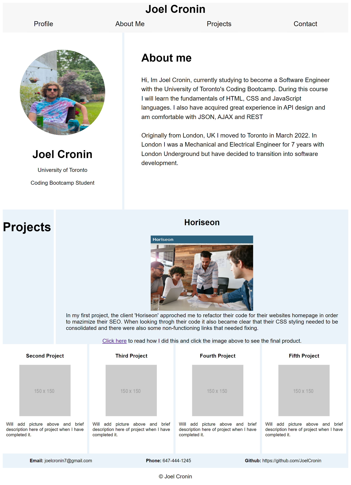

# Joel Cronin's Portfolio

In order to get a job in software development it is imperative to have a polished and professional looking portfolio to showcase your work. With this in mind, I decided to create my own portfolio in the first week of my coding Bootcamp so that I can put each project in to it as I go.

## Design

I favour a minimalist type style for webpages so went with a simple color scheme of two main colours (white and #eaf2fa) with just one other secondary color for the header and nav bar. On my page, I have laid it out so that I have a profile section with my picture in it, a brief 'About Me' section, then a number of spaces for my future projects. I had finished my first project so put this in first with an image link to the project. 

## Adapting to Different Screen Sizes

To ensure the portfolio can be viewed seamlessly across different devices with different screen sizes, I added two different media query functions to the webpage so that it would the way it is viewed is different for screens above 992px, those in between 768 and 992pxs and also those below 768pxs. 

This is a picture of what it looks like above 992px:

 

ABove 992px I used thicker border lines (6px compared to 2px) as I found they were too thin or even hard to see at just 2px. However, once the screen size went below 992px they went back to 2px. The next change occurs below 768px where I changed the flex-direction from row to column for all the elements on the page so that they stack on top of each other whilst also moving the borders for many elements from the right to the bottom, like in the picture below:

 

## Credits

I used w3 schools to help with flexbox positioning and also this youtube video https://www.youtube.com/watch?v=fYq5PXgSsbE

## Access

To view the portfolio yourself please [click here](https://joelcronin.github.io/super-meme/)
